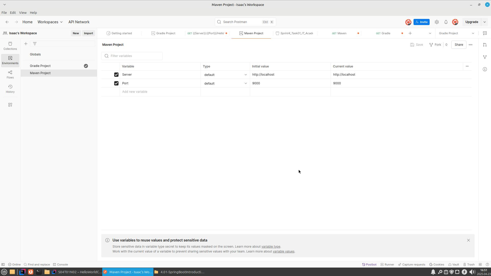
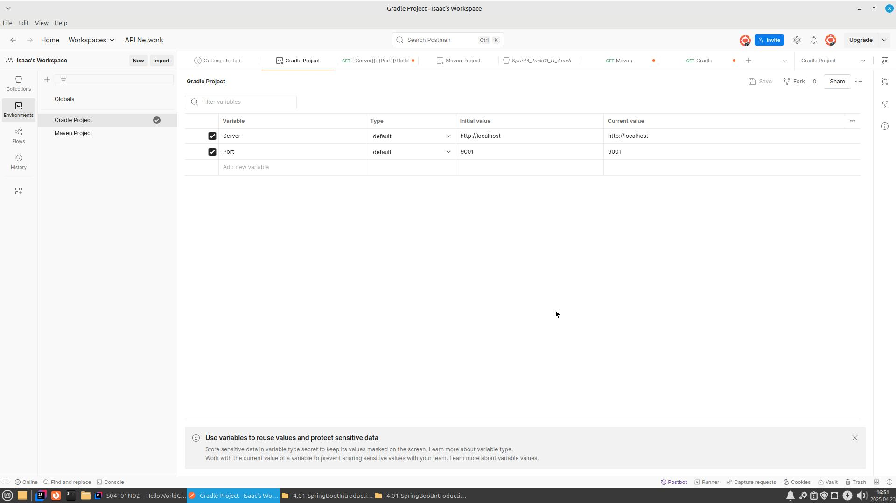
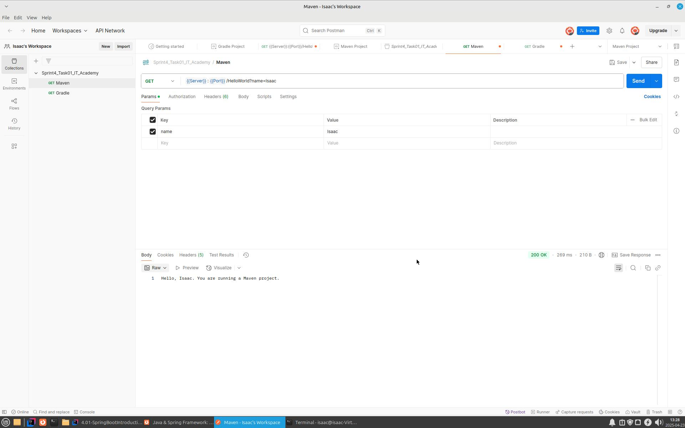
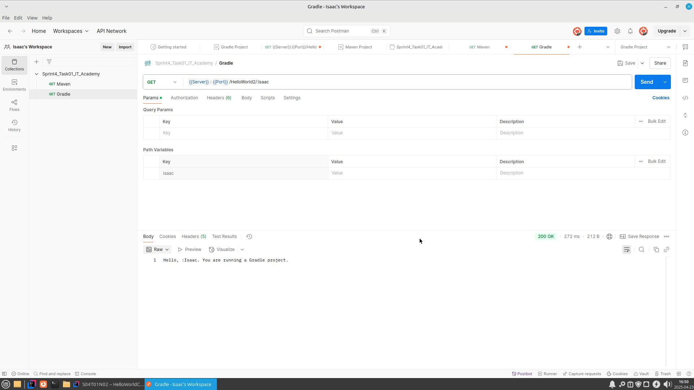

# 4.01-SpringBootIntroduction-L3

# Exercici Postman

Es tracta de provar els anteriors projectes des de Postman.

Crea dos entorns:

- Projecte Maven:

- Projecte Gradle

Ambdós entorns tindran dues variables:

- Servidor, que en els dos casos tindrà el valor http://localhost
- Port, que en el cas del projecte Maven tindrà el valor 9000, i en el cas del projecte Gradle, 9001.

# API Requests

- Maven:

- Gradle:

# Exports

- Maven:
[Maven Project.postman_environment.json](Resources/Maven%20Project.postman_environment.json)
- Gradle:
[Gradle Project.postman_environment.json](Resources/Gradle%20Project.postman_environment.json)

💻Stack used: Project created with:

    Java v.21.
    Maven v.3.9.9.
    Gradle v.8.13 
    IDE IntelliJ Idea v. 24.3.1.1

📋Requirements: No specific requirement but the Java and Maven version or newer.

🛠️Installation:

    Clone this repo: -> git clone

▶️Execution: No specific instruction.

🌐Deployment: N/A.

🤝Contributions:

Contributions are welcome! Please follow the following steps to contribute:

    Fork the repository.
    Create a new: git checkout branch -b feature/News.
    Make your changes and commit them: git commit - 'Add New Functionality'.
    Upload the changes to your branch: git push feature/News.
    Do a pull request.
